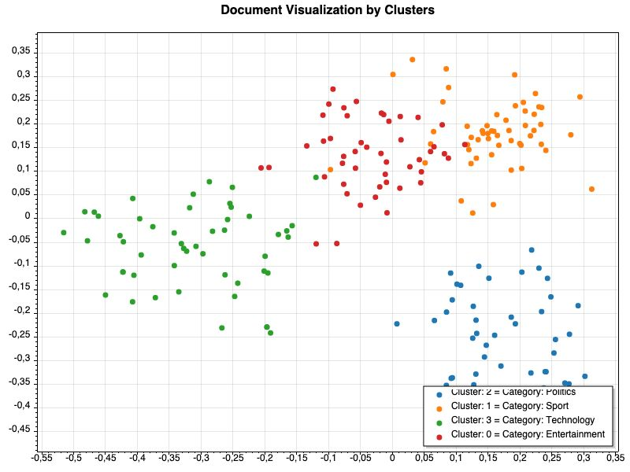

## 1. Project Overview

  

**Title:** Clustering Documents and Visualization of Embedding Vector Space

  

**Objective:** To generate embeddings for a set of documents using OpenAI's GPT, cluster the documents based on their embeddings, and visualize the clusters in a reduced-dimensional space. Additionally, calculate and verify the cosine similarity between documents within and across clusters.

  

## 2. Data Description
The dataset used from Kaggle :
https://www.kaggle.com/datasets/sunilthite/text-document-classification-dataset

The dataset used in this project is a subset of the above text document classification dataset. It contains **200 text documents** categorized into **four distinct classes**: politics, sport, tech and entertainment. This dataset is well-suited for tasks such as **document classification** and **document clustering**, as it provides a diverse range of textual data across multiple domains.

The dataset is organized in a CSV file format.

**Column descriptions:**

| Text | Label |
|--|--|
| A sizeable muliline text document   of about 3000 characters.  | Possible values : 0,1,2,3 |

**Label Mappings** : 
| Value |Meaning  |
|--|--|
| 0 | Politics |
| 1 | Sport |
| 2 |  Technology|
| 3 | Entertainment |

## 3. Process & Output Description

 1. **Load CSV Data**
 2. **Generation of Embeddings**
 3. **Run K-Means Algorithm**
 4. **Visualization Process with PCA**
 5. **Cosine Similarity calculations**
 6. **Output Description**

  

#### 1. Load CSV Data
Loading of CSV data file and mapping the columns to parameters in the `Document` model class using `CsvHelper` library. Each row of the CSSV file corresponds to one object of `Document` class. 
 `Text` column gets mapped to `Content` parameter and `Label` column to `Category` column.
  
#### 2. Generation of Embeddings
`OpenAI` library used to call the OpenAI endpoints for generating embeddings. The model used is `text-embedding-3-large`.

#### 3. Run K-Means Algorithm
The library used for K-Means algorithm is `Accord.MachineLearning`. After the clustering algorithm is run, each `Document` is assigned a "cluster ID" and it is set in the parameter `ClusterId` .

#### 4. PCA & Visualization Process 
To visulizalize the high dimensional vectors, PCA is applied to the embedding vectors to get to 2D vectors. Library used is `ScottPlot`
Three graphs are generated : 

 1. Vector Space visualization
 2. Original/True clusters according to labels 
 3. Clusters assigned by K-Means algorithm

#### 5. Cosine Similarity Results 
A text file is generated with various parameters such as Cluster purity, Intra-Cluster cosine similarity, Inter-Cluster Cosine similarity. Further clarifications in the Output explanations. 

#### 5. Output explanations

This process generates the following outputs:

  

1.  **Visualizations (PNG Images):**

*  `categories.png`: A 2D scatter plot of documents, colored according to their original category.

*  `clusters.png`: A 2D scatter plot of documents, colored according to their cluster assigned by the
K-Means clustering algorithm. 
As it can be seen, most of the points match the original groupings they belong to. But some points 
that lie on the boundary of the original groupings are mis-classified. 

* `heatmap.png` : A 2D Heatmap that shows that the embeddings belonging to the same category have similar
patterns of the scalar values in the vector. For example : For category sport, at position 100 in the vector, 
most of the embeddings might have a high value. This can be seen by observing dark and light colored patters in 
each of the sections of the heatmap that represent each category.

2.  **Evaluation Report (TXT File: `cluster_evaluation.txt`):**

* A text file containing quantitative metrics for assessing the clustering quality. Key metrics include:

* Average Intra-Cluster Similarity

* Average Inter-Cluster Similarity

* Cluster-to-Category Mapping and Purity

* Individual Cluster and Category Similarity Scores

* Silhouette Coefficient

  

---

  

## Project Structure

  

---

  

## Setup Instructions

1. Clone the repository. 
2. Open the GPTDocumentClustering project in Visual Studio or Jetbrains Rider IDE. 
3. Add 2 environment variables in the IDE: 
    * OPENAI_API_KEY - value needs to be API key 
    * INPUT_FILE_PATH - value needs to be the path to input CSV file
                        that is present in Dataset folder (dataset.csv)
4. Build and run the project.
5. The Output folder will be generated in bin/ folder.

### 1. Prerequisites

  

-  **Programming Language**: .NET Core

-  **Dependencies**: Install required NuGet packages

  

  

